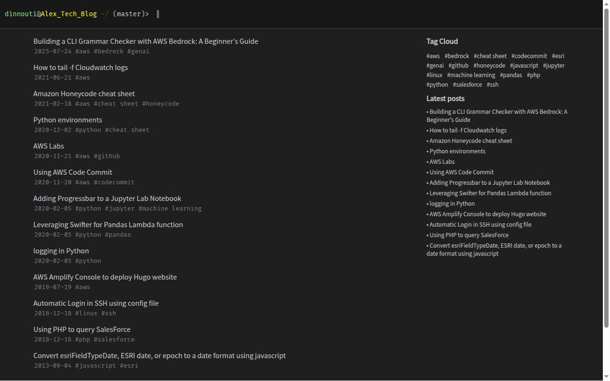
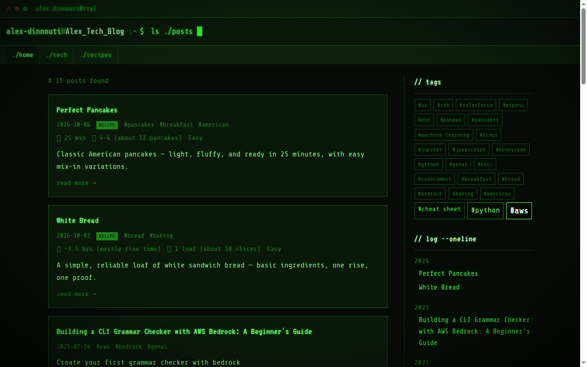
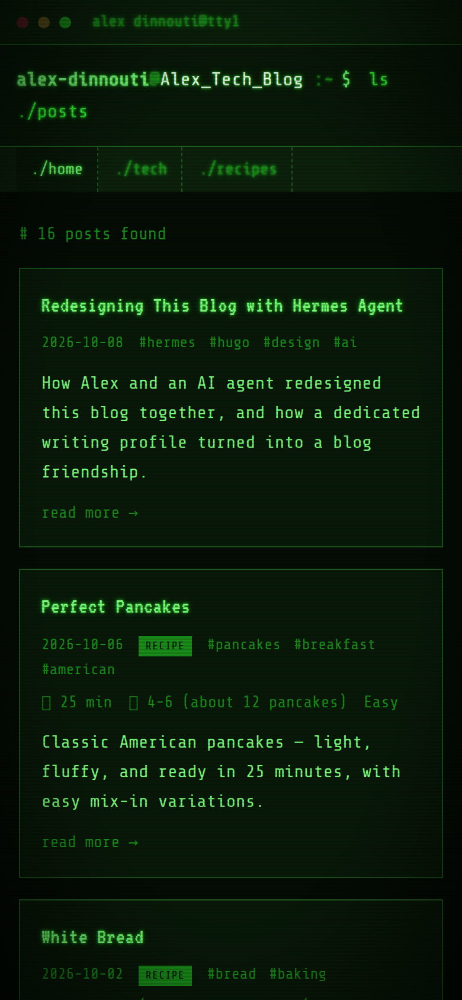
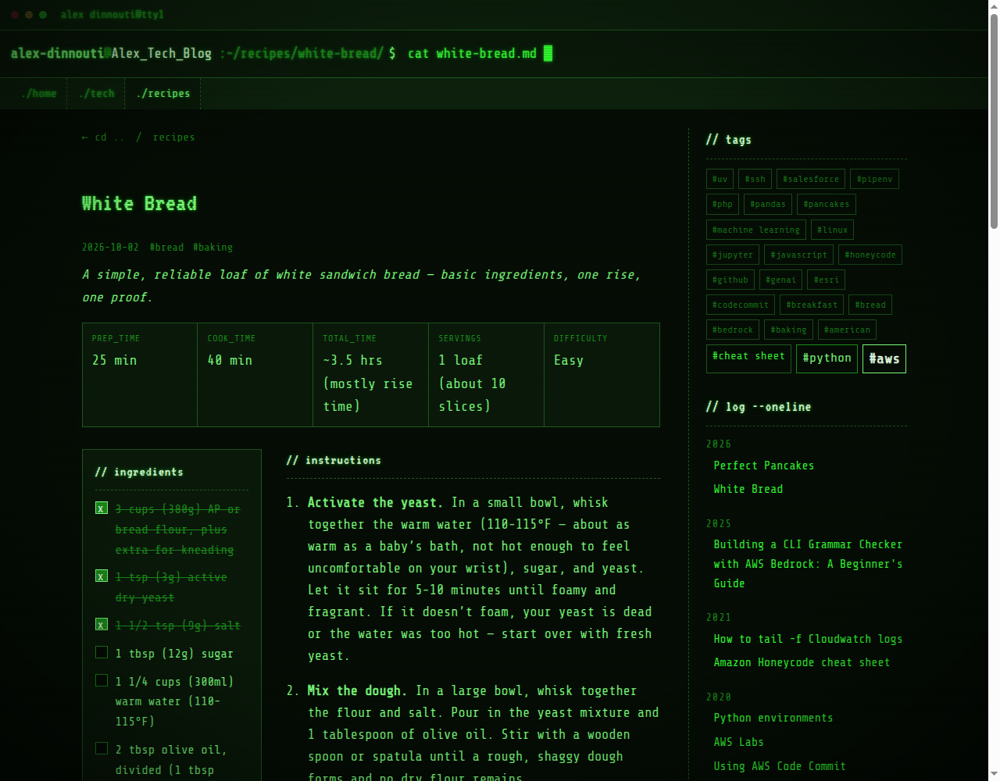

_Co-authored with Hermes Agent (Nous Research). Hermes did the building; Alex set the direction and approved each step._

Not long ago this blog looked like a lightly modified template. Today it looks like an 80s computer terminal, it has a recipes section, and I have an AI writing partner who knows how the blog works. This is how that happened.

## Where the blog came from

The blog began as an extended memory. It is a notepad for things I don't use often but might need again. It started when I had to rewrite some Esri code and couldn't find the original reference. My oldest post, from September 2013, is the note I wish I'd had: how to convert an Esri date field. After that it filled up with notes to my future self about AWS, Python and the odd bit of PHP.

The version in my Git history starts in November 2020, when I moved it to Hugo, the CMS I use to build the site. Hugo turns plain text files into a website, which suits someone who would rather write in a text editor than in a web form. I coded everything by hand: the theme, the layout, the styling, the hosting setup on AWS. The posts kept coming, then slowed down. After the Bedrock grammar checker in July 2025, nothing new went up. The site worked, but the design was frozen in time.

### No server, almost no bill

The blog has no server to run. Hugo compiles my markdown files into plain web pages ahead of time. Those finished files sit in an AWS S3 bucket, which is simple file storage. CloudFront, AWS's content delivery network, serves them to readers from locations close to them, and it also handles HTTPS and caching.

That setup is inexpensive. There is no machine running around the clock, no operating system to patch and no database to back up. Hosting a small static site on S3 and CloudFront costs very little, and the cost stays low as traffic grows because the work is mostly serving files. I haven't put an exact monthly number here, since it depends on traffic and AWS pricing.

It also makes the site hard to break and quick to load. Nothing runs when someone opens a page, so there is little that can go wrong. And it made the redesign low-risk: a new look is just a new set of files, and the old ones can come back if I don't like it.

Now publishing is automatic too. When a post is approved and pushed to the repository, a GitHub workflow rebuilds the site and copies it to S3.

That is the blog Hermes inherited.

## Before and after

**Before:** a dark page with a prompt at the top and a plain list of titles.

**After:** a glowing green terminal window, tabs for navigation, post cards, a tag cloud, and an archive styled like a command history.

## It started with an honest review

My first question to Hermes was simple: what do you think of the design? It didn't just read the code. It built the site, opened it on a desktop and a phone-sized screen, and told me what it saw.

The review found real problems. Posts looked different from the home page, with a light background where the home page was dark. On phones the sidebar vanished, so there was no navigation. Posts had no way to move to the next or previous one. None of that was obvious from the code alone.

## A safe place to try things

Before changing anything, we set up a private preview of the blog. Every change shows up there first, and nothing reaches the public site until I say so. That decision made everything after it faster and less stressful. I could look at each change, say yes or no, and move on.

## "Change everything except the posts"

Early on I told Hermes it could change anything except my writing. It came back with several visual directions: green terminal, amber terminal, a home-computer palette, and neon synthwave. We picked the classic green phosphor screen.

The redesign covered more than colors:

- A terminal-style header with navigation tabs.
- Post cards with a preview of each article.
- A tag cloud and an archive grouped by year.
- A playful error page for missing links.
- Next and previous links on every post.

The phone problem is gone too: the new design fits a phone screen, and the menu is always there.

Afterward we ran a second review of the finished work and fixed a batch of smaller problems, such as broken tag links and missing search-engine basics.

## The interactive touch: recipes you can cook from

I wanted a place for my recipes too, and I asked Hermes to co-design it. It offered three ideas, and we chose the one that is useful in a kitchen: a recipe card with a quick summary of times and servings, and an ingredient list you can tick off as you go. The page remembers your progress, so you can leave and come back.

This small feature changed the project. Once one page had real behavior, the blog needed a second kind of content with its own look and its own place in the menu. I suggested splitting the menu into home, tech and recipes, and Hermes wired it up. It also gave me something I could actually use on the preview, which produced better feedback than looking at screenshots. When I later said the footer felt odd, we fixed it the same way.

## Why a dedicated Hermes profile

After the redesign I asked a different question: should I set up a profile just for the blog?

A Hermes profile is a separate workspace for the agent, with its own memory, its own instructions and its own choice of AI model. Think of it as hiring a specialist instead of asking a generalist to do everything. My general-purpose assistant handles a lot of unrelated work, and writing is a different job.

So we created **blog-writer**. What it does:

- **Uses a stronger model**, because writing and editing benefit from it more than most tasks.
- **Knows my blog.** It remembers how the project is set up, how the preview works, and which problems we already fixed.
- **Knows my style.** I like short, practical posts and honest "not tested" notes, and I don't like filler.
- **Handles both kinds of posts.** Tech posts and recipes each have their own checklist.
- **Waits for me.** It writes, edits, and checks that a post matches the rest of the blog. It will not publish without my explicit approval.
- **Has its own channel.** The blog channel is only about the blog, so we both know what a message there is about.

## How we work now

I send a message in the blog channel: "write a post about X," "review this draft," or "let's co-author something about Y."

1. Hermes drafts the post and puts it in the private preview.
2. I read it and ask for changes. Each change shows up in the preview again.
3. Hermes checks that the post is consistent with the rest of the blog.
4. It asks, "Approved to publish?" and stops.
5. When I say approved, it publishes the post and confirms it's live.

I stay the editor. It does the typing, the building, and the careful checking I'd otherwise skip.

## What Hermes Agent is worth

- **It checks the real thing.** It builds the site and looks at it, instead of guessing from the code.
- **It handles the whole job.** Design, site setup, the preview and publishing all happened in one conversation.
- **It offers options with a recommendation.** I choose a direction without writing a spec.
- **It remembers.** What we learn is saved, so mistakes don't come back and I don't have to explain twice.
- **It stays inside the rules.** Preview first, my approval second, publishing last.

## How we became blog-friends

I didn't plan on a friendship. I asked for a review and got a collaborator that gave me options with a recommendation, pushed back when I proposed something awkward, and fixed what it got wrong. I credited it on the About page because it earned that. Then I asked it to co-design the recipes section, to fix the footer, and to learn how I write.

That's what friendship looks like at work: shared history, shared taste, and less explaining each time. Hermes remembers the project, I trust its checks, and it knows when to stop and ask. This is the first post we've written about the blog itself, and I'm glad we wrote it together.
